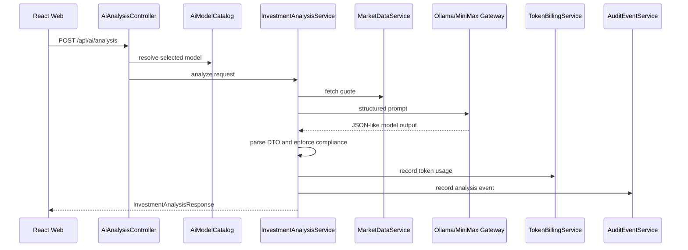

# Agent Design

## Agent 职责

- `MarketDataAgent`：采集、清洗、校验市场数据，记录数据来源、时间、置信度、假设和风险。
- `PortfolioAgent`：分析持仓结构、盈亏、资产集中度和再平衡空间。
- `RiskAgent`：评估波动、集中度、回撤、流动性、杠杆和用户画像缺口。
- `StrategyAgent`：生成辅助分析、可选方案和教育性解释，不给确定性收益承诺。
- `ComplianceAgent`：检查输出是否包含免责声明、风险提示、假设、数据来源和禁止用语。
- `AnalysisAgent`：阶段 4 已落地的单 Agent 入口，负责调用选定模型并生成结构化投资分析。
- `SupervisorAgent`：阶段 5 起编排任务、触发人工介入、汇总结结构化结果。

## 阶段 4 已落地的 AI 分析流



## 结构化输出草案

```json
{
  "analysisId": 1,
  "symbol": "AAPL",
  "model": {
    "id": "ollama-qwen2.5-3b",
    "provider": "OLLAMA",
    "billingMode": "FREE_LOCAL_TOKEN_ACCOUNTING"
  },
  "investmentSummary": "Educational analysis summary.",
  "keyObservations": ["Observation"],
  "assumptions": ["Assumption"],
  "riskWarnings": ["Investment involves risk."],
  "educationalNotes": ["Use this as auxiliary research only."],
  "confidence": 0.42,
  "tokenUsage": {
    "promptTokens": 120,
    "completionTokens": 80,
    "totalTokens": 200,
    "usageSource": "ESTIMATED",
    "estimatedCost": 0,
    "currency": "USD",
    "billable": false
  },
  "disclaimer": "This system provides educational explanations only."
}
```

## 禁止输出

- “保证上涨”
- “稳赚”
- “必买”
- “无风险收益”
- 未说明假设和风险的强个性化建议

## 人工介入触发点

- 生成投资建议或组合再平衡建议。
- 调用外部付费或受限市场数据接口。
- 启用 MiniMax 等付费模型给真实用户使用。
- 运行 Sandbox 脚本或策略回测。
- 新增、修改、启用 Skill。
- 推送远程仓库或发布演示环境。
