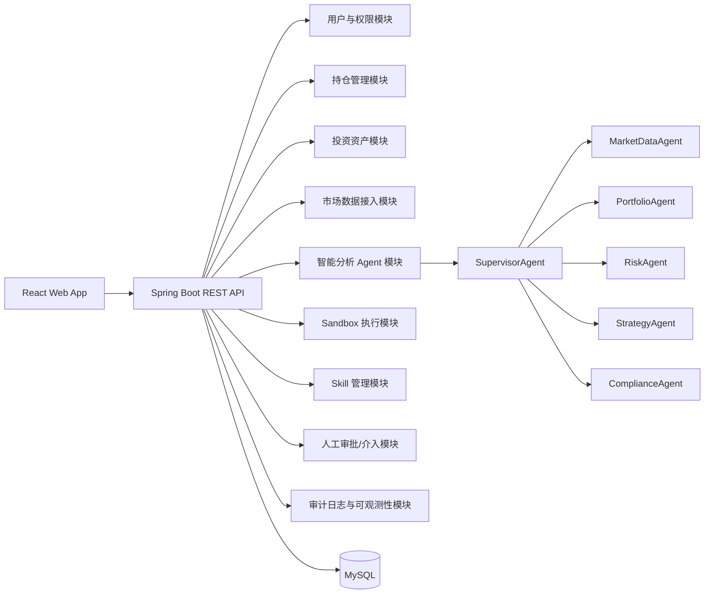

# Architecture

## 目标

系统面向个人投资研究与持仓管理，强调可运行、可审计、可逐步扩展。阶段 0 先建立后端、前端、数据库、文档和合规基线，后续阶段逐步接入认证、持仓、市场数据、Agent、Sandbox、Skill 与审批。

## 模块边界

## 后端分层

- `web`：REST Controller、异常处理、DTO。
- `security`：认证、授权、CORS、方法级权限。
- `audit`：审计实体、仓储、服务。
- `compliance`：免责声明、输出约束、合规检查。
- `agent`：阶段 4 起接入 Spring AI 和结构化 Agent 输出。
- `sandbox`：阶段 6 起提供受限执行、超时、资源限制和审计。
- `skill`：阶段 7 起提供 Skill 版本化、测试和审批流。

## 数据策略

- 本地开发优先使用 Docker Compose MySQL。
- 测试使用 H2 MySQL mode，保证 CI 轻量运行。
- Schema 通过 Flyway 迁移，避免手工建表。
- 真实密钥不进入仓库，使用环境变量注入。

## 合规与安全

- 投资相关输出必须带免责声明、数据来源、假设、置信度和风险。
- 对杠杆、短线、集中持仓、高波动资产主动提示风险。
- 高风险操作进入人工审批队列。
- Sandbox 和 Skill 更新都必须写入审计日志。

