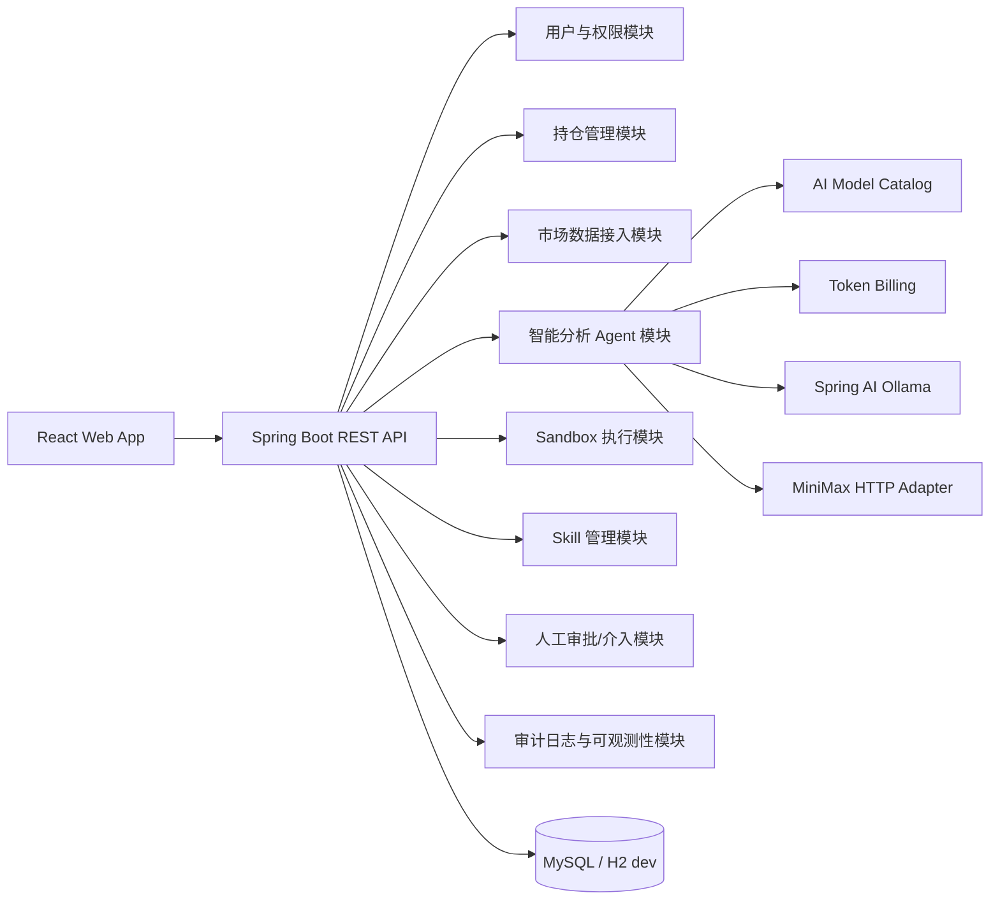

# Architecture

## 目标

系统面向个人投资研究与持仓管理，强调可运行、可审计、可观测、可扩展和金融合规。阶段 4 已形成“认证 + 持仓 + 市场数据 + AI 分析 + token 计费”的最小闭环，后续将继续演进 multi-agent、sandbox、skill 和人工审批。

## 模块边界

## 后端分层

- `web`：REST Controller、异常处理、通用 API 响应。
- `security`：认证、授权、CORS、JWT、方法级权限。
- `audit`：审计实体、仓储、服务。
- `compliance`：免责声明、风险提示、输出约束。
- `portfolio`：资产、交易流水、持仓汇总、盈亏计算和组合风险摘要。
- `marketdata`：市场数据 Provider 抽象、本地 mock quote、外部适配预留、报价来源和风险提示。
- `agent`：模型目录、Spring AI Ollama 网关、MiniMax 适配预留、结构化分析、token 计费和 AI task 记录。
- `sandbox`：阶段 6 起提供受限执行、超时、资源限制和审计。
- `skill`：阶段 7 起提供 Skill 版本化、测试和审批流。

## AI 模型策略

- `ollama-qwen2.5-3b`：默认本地免费模型，走 Spring AI Ollama，token 记录用于观测和容量评估，成本为 0。
- `minimax-chat`：付费模型预留，必须配置 `MINIMAX_API_KEY`，并通过 `AI_TEST_MODE=true` 或 `AI_PAID_ACCESS_ENABLED=true` 才会启用。
- 测试环境通过 `AI_MOCK_RESPONSES=true` 使用确定性响应，避免测试依赖本地 Ollama 或外部网络。
- token 费用只按配置价格估算，不硬编码真实供应商价格。

## 数据策略

- 本地开发优先使用 Docker Compose MySQL。
- 演示和受限环境支持 H2 dev profile。
- Schema 通过 Flyway 迁移，避免手工建表。
- 真实密钥不进入仓库，只通过环境变量注入。
- AI analysis task 和 token usage record 独立持久化，便于审计、回放和后续计费。

## 合规与安全

- 投资相关输出必须带免责声明、数据来源、假设、置信度和风险。
- 对杠杆、短线、集中持仓、高波动资产主动提示风险。
- 服务端会对模型输出做合规兜底，过滤“保证收益”“必买”等确定性表述。
- 高风险操作进入人工审批队列。
- Sandbox 和 Skill 更新必须写入审计日志。
